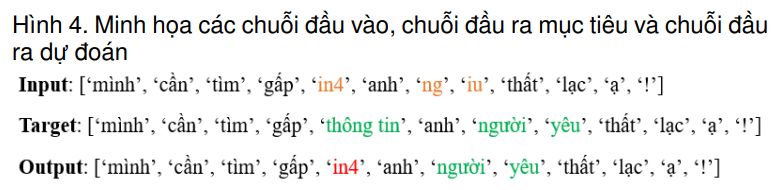
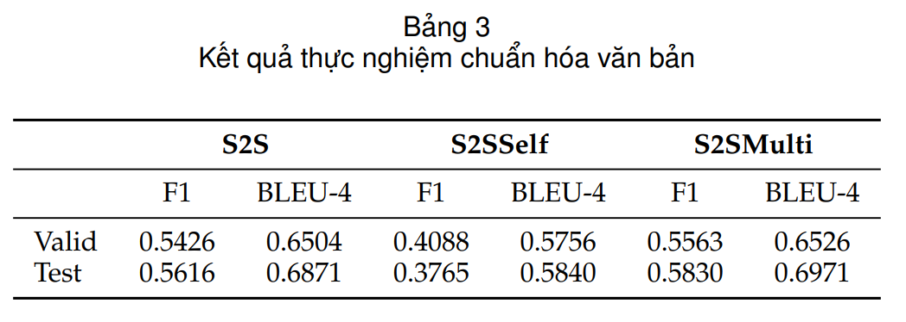
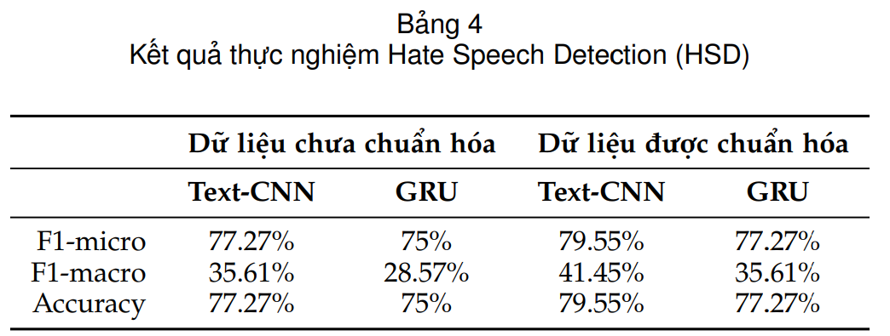

# Social Media Textual Normalization

This is the repository for the final project of IE403 (Social Media Data Mining) of the University of Information Technology (UIT).

In this project, we aimed for three main targets:

<ol>
 <li>
  The main goal is to build a dataset for the problem of standardizing Vietnamese on social networks. The dataset will include comments in non-standard form and standard form, labeled accordingly.
 </li>
 <li>
  Standardize Vietnamese sentences from non-standard form to standard form. The problem is solved using sequence-to-sequence models on the newly built dataset.
 </li>
 <li>
  It is assumed that text normalization improves the performance of other NLP tasks more than simple preprocessing steps. The project tests this hypothesis by evaluating the Hate Speech Detection (HSD) task on unstandardized and standardized text.
 </li>
</ol>

## Dataset
We manually labeled 3400 comments following the annotation guide <code>./Annotation Guideline.pdf</code> and preprocessed data in <code>./preprocessing.ipynb</code>

Tidy data used in this project can be accessed via https://github.com/HaDung2002/Small-LexNormViHSD

## Experiments and Results
<ol>
 <li>
  <strong>Textual Normalization</strong>

  
  This project used the Seq2Seq model (S2S) and its variants (S2SSelf and S2SMulti) to transform an input sequence (non-standard sentence) into an output sequence (standardized sentence).
  

   
  

  The outcomes of text normalization are deemed suboptimal, with all metrics falling below the 70% threshold. Notably, the S2SMulti model demonstrates superior proficiency in normalizing text, showcasing adeptness in managing contextual intricacies and exhibiting robust generalization to novel data instances. Results obtained from the S2S model align closely with those of the S2SMulti model. Conversely, the S2SSelf model registers the lowest performance across both measures.
  

   
  

 </li>
 <li>
  <strong>Hate Speech Detection</strong>

  This experiment seeks to assess the significance and necessity of text normalization during the data preprocessing phase for intricate Natural Language Processing (NLP) tasks, specifically focusing on Hate Speech Detection (HSD). The findings reveal that text normalization contributes to a roughly 2% enhancement in accuracy for the HSD task, as measured by both F1-micro and Accuracy metrics. Additionally, there is a notable improvement of approximately 6-7% in the F1-macro measure for both models. In conclusion, relative to conventional simple preprocessing steps, text normalization proves to be advantageous in augmenting the performance of Hate Speech Detection in this specific context.
  

   
  

 </li>
</ol>

For more information about the project, please read our report <code>./Report.pdf</code> or contact us via email address 20520165@gm.uit.edu.vn or 20520134@gm.uit.edu.vn
